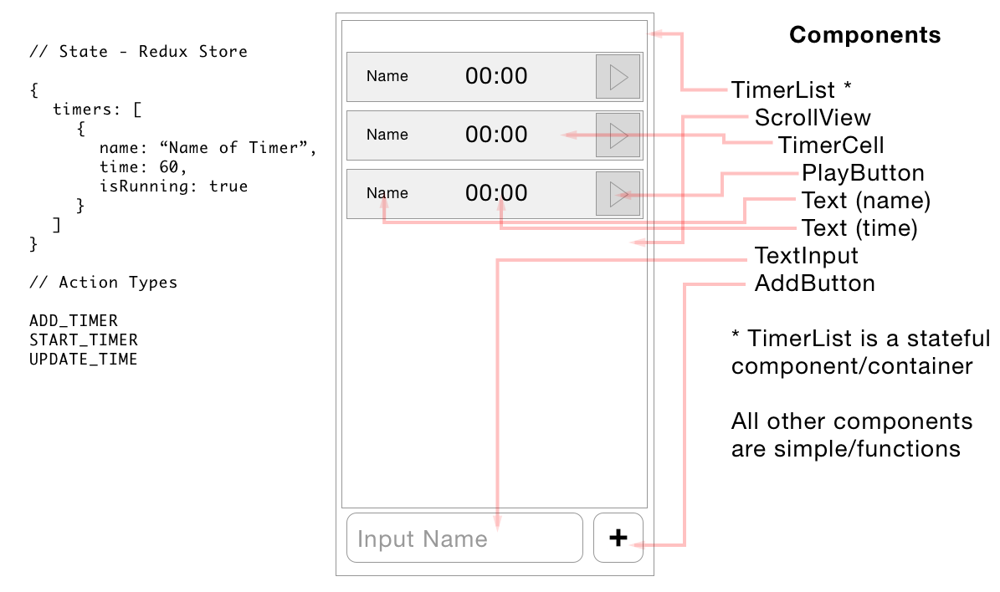

# More Redux

After working through the Redux tutorials in the previous section it's time to build
a larger project with Redux. 

# Timerz

Timerz is an app that creates timers. Each timer has a run/pause button, and shows the 
a name and the length of time the timer has been running. Your first goal is to 
implement these features: 

- Set up Redux to store an array of Timer Objects. 
    - Each Timer is an Object with these properties:
        - name - String
        - time - Number
        - isRunning - Bool
    - You'll need some actions
        - ADD_TIMER
    - You'll need a reducer to handle this action
- Use a ScrollView to display the timers in the list

## Components and state

When planning the structure of your app keep in mind that you will want to keep your 
business logic and state up higher in your component architecture. Use simple 
components when a component is nested. 

When you have state it's best to keep it up as close to the root of your component 
architecture as possible. 

When a component displays state pass state in as a prop, rather than have that 
component store it's own state. 

## React Native Components 

Here are a few components that will come in handy for this assignment. 

### TouchableOpacity

This is a component that wraps other components and turns them into an interactive 
button. TouchableOpacity changes the opacity of it's children when typed, and calls
it's `onPress` method when touched. 

Important properties:

- focussedOpacity
- activeOpacity 
- onPress

https://facebook.github.io/react-native/docs/touchableopacity.html

### Image

Image displays an image. You can use this will TouchableOpacity to create custom buttons. 

Important properties: 

- source
- resizeMode

https://facebook.github.io/react-native/docs/image.html

### TextInput

Creates a text input. Remember to wrap this in a View. I had better luck positioning and 
sing it this way. 

It's best to use the onChange handler to set the text in the input as a value on state 
for the component, while setting the value of the textInput to display the value. 

Important properties: 

- onChange
- value

https://facebook.github.io/react-native/docs/textinput.html

## Challenges

Your goal is to create a an app with React Native that keeps a list of timers. Use 
Redux and store the timers as application state. 

Imagine this app as a tool to keep a list of timers that track the time spent working 
at different tasks. You can add tasks to the list, start or stop a timer. Timers keep 
track of time in seconds, but display the time as HH:MM:SS. 

Your timer app should have these features:

- Add or remove timers. Timers should have these properties: 
    - Time, holds the length of time a timer has been running. 
    - Name, a label to identify a timer. 
    - isRunning, a bool sets whether the timer is running or not. 
- Show a list of timers with a scroll view. 
- Starting one timer should stop the other timers. Only one timer should run at once. 
- Stretch challenges - If you complete the challenge above try these
    - Use Navigator to create a a detail view in the Timers project.
        - The detal view should show detail info for a single timer. 
        - The detail view should have a Back button that returns to the list of timers. 
        - The detail view should provide a button to start and stop the timer. 
        - use the detail view to edit a the name and time of a timer. 

